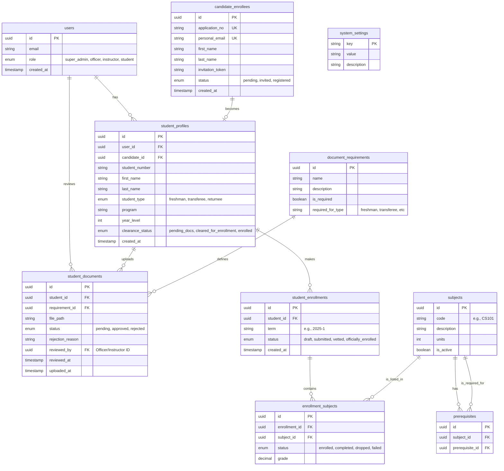

# Database Design for EnrollSys

This document outlines the database schema for the EnrollSys application, based on the requirements defined in `FLOW.md`. The system uses **Supabase (PostgreSQL)**.

## Entity-Relationship Diagram (ERD)

## Table Definitions

### 1. User Management

#### `users`
Managed by Supabase Auth, but usually mirrored or extended in `public.users` for RLS.
- **id**: UUID (Primary Key, references `auth.users`)
- **email**: Text (Unique)
- **role**: Enum (`super_admin`, `officer`, `instructor`, `student`)
- **created_at**: Timestamp

### 2. Candidate Management (Pre-Registration)

#### `candidate_enrollees`
Stores data imported from CSV by Super Admin (Flow SA-3).
- **id**: UUID (PK)
- **application_no**: Text (Unique) - Identifier from the CSV.
- **personal_email**: Text (Unique) - Used for invitation.
- **first_name**: Text
- **last_name**: Text
- **invitation_token**: Text (Unique, Nullable) - Generated when invite is sent.
- **invitation_sent_at**: Timestamp
- **status**: Enum (`pending`, `invited`, `registered`)

### 3. Student Data

#### `student_profiles`
Created upon registration (Flow ST-1).
- **id**: UUID (PK)
- **user_id**: UUID (FK -> users.id)
- **candidate_id**: UUID (FK -> candidate_enrollees.id)
- **first_name**: Text
- **last_name**: Text
- **student_type**: Enum (`freshman`, `transferee`, `returnee`)
- **program**: Text
- **year_level**: Integer
- **clearance_status**: Enum (`pending_docs`, `cleared_for_enrollment`, `enrolled`) - Controls access to Phase 2.
- **updated_at**: Timestamp

### 4. Document Management (Phase 1)

#### `document_requirements`
Configurable list of required documents (Flow SA-6).
- **id**: UUID (PK)
- **name**: Text (e.g., "PSA Birth Certificate")
- **description**: Text
- **required_for_type**: Text/Enum - Specifies which student types need this.

#### `student_documents`
The actual files uploaded by students (Flow ST-2) and reviewed by Officers (OF-3).
- **id**: UUID (PK)
- **student_id**: UUID (FK -> student_profiles.id)
- **requirement_id**: UUID (FK -> document_requirements.id)
- **file_path**: Text - Path in Supabase Storage.
- **status**: Enum (`pending`, `approved`, `rejected`)
- **rejection_reason**: Text (Nullable)
- **reviewed_by**: UUID (FK -> users.id) - Officer who vetted it.
- **reviewed_at**: Timestamp
- **version**: Integer (for tracking re-uploads)

### 5. Academic Management (Phase 2)

#### `subjects`
List of available courses.
- **id**: UUID (PK)
- **code**: Text (e.g., "IT 101")
- **description**: Text
- **units**: Integer
- **is_active**: Boolean

#### `prerequisites`
Rules for subject selection (Flow ST-6).
- **id**: UUID (PK)
- **subject_id**: UUID (FK -> subjects.id)
- **prerequisite_id**: UUID (FK -> subjects.id)

#### `student_enrollments`
Represents the student's enrollment usage for a specific term.
- **id**: UUID (PK)
- **student_id**: UUID (FK -> student_profiles.id)
- **term**: Text
- **status**: Enum (`draft`, `submitted`, `vetted`, `officially_enrolled`)
- **vetted_by**: UUID (FK -> users.id) - Instructor who vetted the load (FA-3).

#### `enrollment_subjects`
The specific subjects a student is taking in an enrollment.
- **id**: UUID (PK)
- **enrollment_id**: UUID (FK -> student_enrollments.id)
- **subject_id**: UUID (FK -> subjects.id)

### 6. Configuration

#### `system_settings`
Global configs (Flow SA-6).
- **key**: Text (PK)
- **value**: Text
